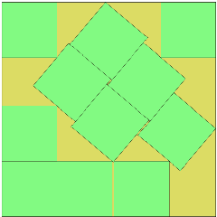

# HPC Evolutionary Algorithm for Square Packing Problem

## Problem description
Project aims to deliver High Performace Computing solution with Python interface.

The exact problem to be solved is [Square Packing Problem](https://en.wikipedia.org/wiki/Square_packing).
Below best currently known solution for 11 squares can be found (credits to Wikipedia).

As some solutions may not be as "elegant" as they would be expected to be, mundate Evolutionary Algorithm may be useful.

## HPC: Julia and Python

When it comes to HPC with Python interface I have tested may other approaches, including:
- Numba (does not full support Numpy )
- Cython (advanced data structures extremely hard to deal with)
- C (lack of OOP, no JIT compilation)
- C++ (no JIT compilation)

but none of these was done as seamlessly as Julia Backend with Python interface. 

Lack of OOP support in Julia enforces us to become Intellectual Snobs via functional programming principia (as the [author](https://github.com/IRatajczyk) has finished Theory of Computation academic course and thinks he is smart - sadly he is not) . Descendants of $\lambda$ - calculus: Closures have been utilized.

## EA

Proposed Genetic operators are rather default for array-like genotypes. Some solutions are similar to these utilized in my other EA-like projects (eg. [this one](https://github.com/IRatajczyk/Island-Evolutionary-Algorithm)).

Larmarkian approach should be implemented for SotA results.

### Usage
Python interface essentially bridges the Julia EvolutionaryAlgorithm package with Python, allowing users to configure and run the evolutionary algorithm in a user-friendly way from Python. It also offers methods to visualize the solutions and the evolution of fitness values over iterations.

Parameters can be passed via JSON file or as Python Dictionary.

Python wrapper has been described in **evolutionary_algorithm.py** file.

Exemplary usage is proposed in **research.ipynb** file.

### Contact
Should you have any questions or should you be willing to cooperate on this project (aforementioned Larmarcian approach) please contact me directly: igor@ratajczyk.eu
